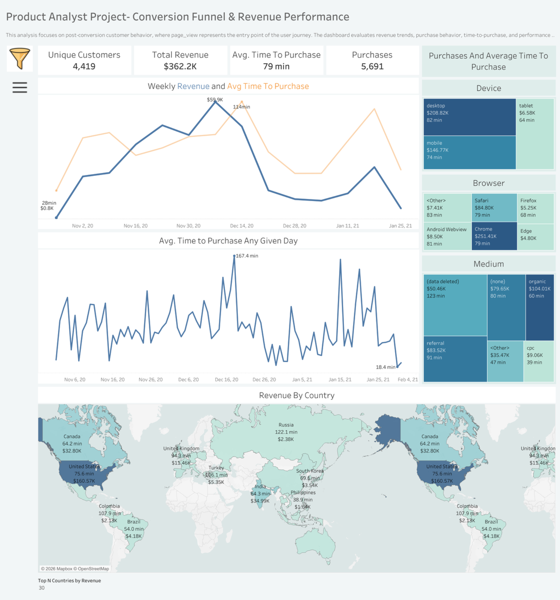

# Portfolio Images

This folder contains visual assets used throughout the **Product Manager Case Studies Portfolio**.  
These images support dashboards, user journeys, KPI summaries, and architectural thinking demonstrated in each project.

---

## Image Categories

### Dashboard Visuals
- **dashboard_overview.png** – High-level KPI and performance summary  
- **kpi_overview.png** – Key product metrics and trends  

### Funnel & Conversion
- **ecommerce_funnel.png** – Ecommerce conversion funnel visualization  

### User Experience
- **user_journey.png** – Signup → First Purchase journey flow  

### Product Usage
- **streamflow_overview.png** – Feature usage and engagement dashboard  

---

## Purpose

These visuals are used to:
- Provide quick metric summaries
- Support case study storytelling
- Illustrate product insights during interviews
- Enhance README documentation across projects

---

## How to Use

- Embed images into project READMEs
- Reference visuals during portfolio walkthroughs
- Use for presentations and recruiter previews

Example Markdown embed:

```markdown

```

---

## Note
All visuals are simulated analytical dashboards and user flow representations created for portfolio and educational demonstration purposes.

---
